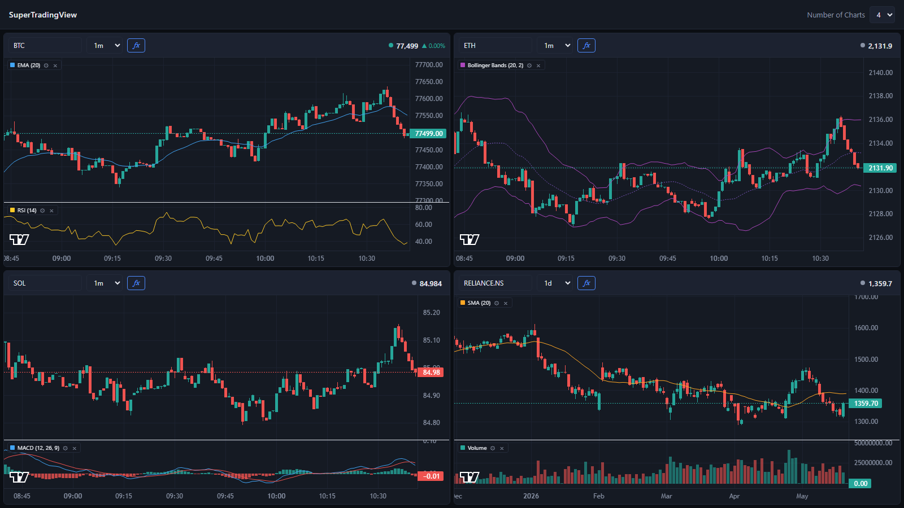

# SuperTradingView

A local trading dashboard. Watch up to 8 live charts side-by-side, each with its own symbol, timeframe, and any combination of 33 technical indicators. Crypto streams in real time from Hyperliquid; stocks / ETFs / futures / FX stream from any ticker Yahoo Finance indexes via a Flask bridge over yfinance. Live symbol search across both. Built on Lightweight Charts v5 with native multi-pane support.



---

## Features

- **Configurable grid** — 1, 2, 4, 6, or 8 charts in the cleanest layout per count (1×1, 2×1, 2×2, 3×2, 4×2). Selection persists across reloads.
- **Independent panes** — each pane picks its own symbol and timeframe (1m, 5m, 15m, 1h, 4h, 1d). Per-pane state persists in `localStorage`.
- **Two default data sources, swappable**
  - **Hyperliquid** for crypto via the public WebSocket (`wss://api.hyperliquid.xyz/ws`), opened directly from the browser. Historical candles are proxied through Flask to avoid CORS.
  - **yfinance** for everything Yahoo Finance covers — NSE/BSE Indian equities, US equities, global ETFs, indices, futures, FX, even crypto pairs. Bridged into the browser via Server-Sent Events: Flask polls every 2 s and emits on price change.
- **Pluggable data layer** — drop in Alpaca / Binance / Zerodha / Groww / Polygon by writing one class in [`data_source.py`](data_source.py) and adding it to the `REGISTRY`. No frontend changes needed.
- **33 technical indicators** with custom params and per-line colours (see table below). Sub-pane indicators render in their own pane below the candles with their own price axis.
- **Multi-instance indicators** — add the same indicator multiple times with different parameters (e.g. SMA 20 + SMA 50 + SMA 200). Each instance is tracked independently with a `#N` badge when multiple copies are active.
- **MA Crossover — Golden / Death Cross** — dedicated indicator plotting a fast MA and slow MA (SMA or EMA) with arrow markers at every crossover event.
- **Per-pane legend chips** in the top-left: indicator name + params + colour swatch + gear (opens modal scrolled to that indicator) + quick remove (×). Controls are hover-only to keep the chart clean.
- **Live colour-coded ticker bar** in each pane header that flashes green or red on every price change.
- **Live symbol search** — as you type in any symbol input, the dropdown queries the backend, which merges:
  - a curated quick-load list of popular Hyperliquid perps and NSE tickers (instant),
  - the full **Hyperliquid perp universe** via `/info?meta` (cached 1 hour),
  - **Yahoo Finance's global search** via `yfinance.Search` — equities, ETFs, indices, futures, crypto across every exchange Yahoo indexes.
- **No build step, no deployment, no API keys** required for the default sources.

---

## Technical Indicators (33 total)

| Category | Indicators |
|---|---|
| Moving Averages | SMA, EMA, WMA, HMA, DEMA, TEMA |
| Bands & Channels | Bollinger Bands, Donchian Channels, Keltner Channels |
| Volume-weighted | VWAP (cumulative) |
| Trend / Levels | Parabolic SAR, SuperTrend, Ichimoku Cloud |
| Oscillators | RSI, Stochastic %K/%D, Stochastic RSI, Williams %R, ROC, CCI, Awesome Osc, Ultimate Osc, TRIX, DPO, CMO |
| Momentum | MACD, ADX (+DI/−DI), Aroon |
| Volatility | ATR |
| Volume | OBV, MFI, CMF, Volume |
| Crossover | MA Crossover — Golden / Death Cross |

---

## Drawing Tools

Each pane has a left-edge toolbar (toggle to floating palette in settings) with 9 drawing tools plus undo/erase utilities:

| Category | Tools |
|---|---|
| Lines | Trendline, Horizontal line, Vertical line |
| Bands & Channels | Rectangle / zone, Parallel channel |
| Levels | Fibonacci retracement |
| Arcs | Arc |
| Measurement | Measurement ruler (Δprice / Δ% / bars / Δtime) |
| Annotation | Text |

- **Shift-to-snap** — hold Shift while clicking to snap endpoints to the nearest OHLC of the targeted candle. Default behaviour is configurable in the ⚙ settings popover (Shift held / Always / Never).
- **Selection** — click any drawing to select it; circular handles appear (drag endpoints to reshape, drag the mid handle to move the whole shape), plus a floating mini-toolbar (✏ edit / ⎘ duplicate / ↑ bring-to-front / × delete).
- **Style modal** — colour, line width, dash pattern, opacity, label text, and extend direction per drawing.
- **Per-(symbol, source) persistence** — drawings follow the symbol across pane changes and timeframe switches; they store absolute time/price coordinates and re-project on every redraw.
- **Undo / redo** — `Ctrl+Z` / `Ctrl+Y` (also `Ctrl+Shift+Z`), 50-entry history per pane (configurable in settings). Per-pane "↺" toolbar button and "×" erase-all (with confirm) also wired.
- **Toolbar mode** — switch between fixed left-edge toolbar and a floating-palette mode (✏ in the pane header opens/closes the palette).

---

## UI / UX

### Top bar
- **Brand accent pill** — gradient mark beside the logo
- **Layout switcher** — five SVG grid-icon buttons (replaces a `<select>`) with the active layout highlighted

### Per-pane header
- **Timeframe pills** — horizontal scrollable pill row (replaces a `<select>`); active pill is highlighted
- **ƒx button** — opens the indicators modal; shows a live badge with the count of active indicators

### Indicators modal
- **Live search** — type to instantly filter the indicator list; shows an empty-state message when nothing matches
- **Active-state accent** — active indicators show a blue left-border highlight
- **Entrance animation** — panel slides up with a scale ease; backdrop fades in
- **Multi-instance UX** — "+ Add" button per indicator; each active instance shows a numbered header with a remove button and inline param editors

### General polish
- Design tokens: `--panel-3`, `--border-hi`, `--accent-hi`, consistent border radii and shadow
- Custom thin scrollbar throughout
- Hover-reveal legend controls (gear / ×)

---

## Quick start

```bash
git clone https://github.com/raunakshroff/SuperTradingView.git
cd SuperTradingView
pip install -r requirements.txt
# Run the app
# macOS / Linux
python3 app.py
# Windows (recommended):
py -3 app.py
```

Then open <http://127.0.0.1:5173>.

Requirements: Python 3.10+ and an internet connection (for the Hyperliquid WS and yfinance HTTP calls). The Lightweight Charts library is loaded from a CDN.

---

## Project layout

```
SuperTradingView/
├── app.py              # Flask app: /, /sources, /symbols, /history, /stream/quotes (SSE)
├── data_source.py      # DataSource ABC + HyperliquidSource + YFinanceSource + REGISTRY
├── symbols.json        # Curated quick-load list; live search supplements via Hyperliquid + Yahoo
├── requirements.txt    # flask, yfinance, requests
└── static/
    ├── index.html      # Topbar, grid, pane template, indicators modal, style modal, settings popover
    ├── style.css       # Dark theme, grid layout, modal, legend chips, flash animations
    ├── indicators.js   # 33 indicator defs with build / compute / apply per indicator
    ├── drawings.js     # 9 drawing tool defs + DrawingLayer + DrawingStore + StyleModal + SettingsPopover
    ├── drawings.css    # Toolbar, handles, mini-toolbar, style modal, settings popover
    └── app.js          # Pane class, HL WS multiplexer, SSE client, modal, legends, debounced symbol search
```

---

## HTTP endpoints

| Method | Path | Purpose |
|---|---|---|
| `GET` | `/` | Serves the dashboard |
| `GET` | `/sources` | `[{name, asset_class}]` — registered data sources |
| `GET` | `/symbols` | Curated symbol list + supported timeframes |
| `GET` | `/symbols?q=...` | Live search merging curated + every source's `search_symbols(q)` |
| `GET` | `/history?source=...&symbol=...&tf=...&limit=500` | OHLCV array from the named source |
| `GET` | `/stream/quotes?source=...&symbol=...&tf=...` | SSE stream of `{time, price}` ticks |

---

## Adding a new data source

Subclass `DataSource` in [`data_source.py`](data_source.py) and register it:

```python
class AlpacaSource(DataSource):
    name = "alpaca"
    asset_class = "stock"

    def get_history(self, symbol: str, timeframe: str, limit: int = 500) -> list[Candle]:
        ...

    def stream_quotes(self, symbol: str, timeframe: str) -> Iterator[Quote]:
        # yield Quote objects; Flask /stream/quotes relays them via SSE
        ...

    def search_symbols(self, query: str) -> list[dict]:
        # Called by /symbols?q=... — return up to ~25 matches as
        # [{symbol, label, source: "alpaca", asset_class}, ...]
        ...

REGISTRY["alpaca"] = AlpacaSource()
```

`search_symbols` is optional — return `[]` to opt out and add entries to `symbols.json` instead.

---

## Adding a new indicator

Append one definition to `DEFS` in [`static/indicators.js`](static/indicators.js):

```js
{
  id: "myind", name: "My Indicator", category: "Custom",
  overlay: true,        // true = draws on candle pane, false = own sub-pane
  params: [{ key: "period", default: 14, min: 2, max: 500 }],
  colors: [{ key: "line", label: "Line", default: "#42a5f5" }],
  build:   (chart, paneIndex, col) => [ohlcLine(chart, col.line, paneIndex)],
  compute: (candles, p)            => myMath(candles, +p.period),
  apply:   (series, data)          => series[0].setData(data),
}
```

The modal, chart wiring, persistence, sub-pane layout, legend chip, multi-instance support, and colour pickers all pick it up with no further changes.

---

## Architecture notes

- **Frontend is a single page with no framework** — `static/app.js` is ~900 lines of vanilla JS organised around a `Pane` class. One chart instance per pane.
- **Hyperliquid WebSocket multiplexer** — a single WS connection feeds every crypto pane via a callback registry, with exponential-backoff reconnect (1 s → 30 s cap).
- **yfinance over SSE** — `stream_quotes()` is a Python generator polled every 2 s; the browser patches the in-memory candle array via `EventSource`.
- **Lightweight Charts v5 multi-pane** — sub-pane indicators are added via `chart.addSeries(LineSeries, opts, paneIndex)` with proportional `setStretchFactor`.
- **Indicator instance keys** — first instance uses bare `defId` (e.g. `"sma"`) for backward compat with persisted state; subsequent instances append `~<timestamp>` (e.g. `"sma~1716200000000"`).
- **State persistence** — `stv.chartCount` and `stv.panes` in `localStorage`. Per-pane state shape: `{ source, symbol, tf, indicators: { [key]: { ...params, colors: { [slot]: hex } } } }`.

---

## License

MIT
