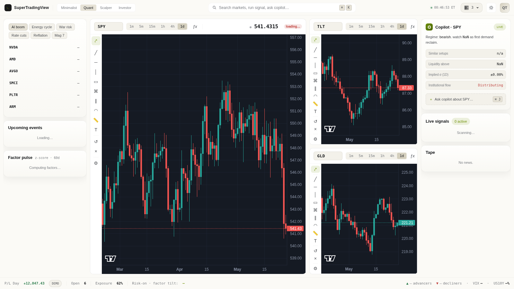

# SuperTradingView

A local trading dashboard with a full workspace shell. Watch up to 8 live charts in a configurable grid, each with its own symbol, timeframe, and any combination of 33 technical indicators. Flanking the charts: a left-rail of narratives / factor pulse / events and a right-rail of AI insight / live signals / news tape. A bottom dock shows real-time breadth, VIX, and US10Y. Crypto streams via Hyperliquid's public WebSocket; stocks / ETFs / futures / FX stream through a Flask–yfinance SSE bridge.




---

## Features

### Workspace

- **Three-column layout** — left rail (narratives / events / factor pulse), center chart grid, right rail (AI insight / live signals / news tape).
- **Bottom dock** — live advancers / decliners across a 100-symbol universe, VIX, US10Y, and a DEMO P/L placeholder.
- **Personality presets** — segmented control in the top bar: **Minimalist** (1-up NVDA, 1D), **Quant** (4-up SPY/NVDA/TLT/VIX, 1h), **Scalper** (4-up ES/NQ/NVDA/TSLA, 5m), **Investor** (1+2 SPY/TLT/GLD, 1D). Switching applies the preset's layout, symbols, and timeframe while preserving per-slot indicators.
- **7-preset layout selector** — top-right popover with `1 up`, `2 H`, `2 V`, `1+2`, `2×2`, `3×2`, `4×2`. Switch by clicking or via <kbd>⌘/Ctrl</kbd>+<kbd>1–7</kbd>.
- **Command palette** — <kbd>⌘K</kbd> / <kbd>Ctrl K</kbd> opens a global symbol search that jumps the result to pane 1.
- **Live ET clock** with daylight-saving correction.
- **Theme toggle** — obsidian dark (electric-lime acid accent) ↔ warm-paper light (olive acid accent). Persisted to `localStorage`.

### Charts

- **Configurable grid** — 1–8 charts (7 layout presets). Selection persists across reloads.
- **Independent panes** — each pane picks its own symbol and timeframe (1m, 5m, 15m, 1h, 4h, 1d). Per-pane state persists in `localStorage`.
- **Two default data sources, swappable**
  - **Hyperliquid** for crypto via the public WebSocket (`wss://api.hyperliquid.xyz/ws`), opened directly from the browser. Historical candles are proxied through Flask to avoid CORS.
  - **yfinance** for everything Yahoo Finance covers — NSE/BSE Indian equities, US equities, global ETFs, indices, futures, FX, crypto pairs. Bridged via Server-Sent Events: Flask polls every 2 s and emits on price change.
- **Pluggable data layer** — drop in Alpaca / Binance / Zerodha / Groww / Polygon by writing one class in [`data_source.py`](data_source.py) and adding it to `REGISTRY`. No frontend changes needed.
- **33 technical indicators** with custom params and per-line colours (see table below). Sub-pane indicators render in their own pane with their own price axis.
- **Multi-instance indicators** — add the same indicator multiple times with different parameters (e.g. SMA 20 + SMA 50 + SMA 200). Each instance is tracked independently with a `#N` badge when multiple copies are active.
- **MA Crossover — Golden / Death Cross** — dedicated indicator plotting a fast MA and slow MA (SMA or EMA) with arrow markers at every crossover event.
- **Per-pane legend chips** — indicator name + params + colour swatch + gear (opens modal) + quick remove (×). Hover-only to keep the chart clean.
- **Live colour-coded ticker bar** in each pane header, flashing green or red on every price change.
- **Live symbol search** — as you type, the backend merges a curated quick-load list, the full Hyperliquid perp universe, and Yahoo Finance's global search.
- **No build step, no deployment, no API keys** required for the default sources.

### Drawing Tools

Each pane has a left-edge toolbar (toggle to floating palette in settings) with 9 tools plus undo / erase utilities:

| Category | Tools |
|---|---|
| Lines | Trendline, Horizontal line, Vertical line |
| Bands & Channels | Rectangle / zone, Parallel channel |
| Levels | Fibonacci retracement |
| Arcs | Arc |
| Measurement | Measurement ruler (Δprice / Δ% / bars / Δtime) |
| Annotation | Text |

- **Shift-to-snap** — hold Shift to snap endpoints to the nearest OHLC of the targeted candle. Default configurable in ⚙ settings popover (Held / Always / Never).
- **Selection** — click to select; drag handles to reshape, drag mid-handle to move; floating mini-toolbar (✏ edit / ⎘ duplicate / ↑ bring-to-front / × delete).
- **Style modal** — colour, line width, dash pattern, opacity, label text, extend direction per drawing.
- **Per-(symbol, source) persistence** — drawings follow the symbol across pane changes and timeframe switches.
- **Undo / redo** — <kbd>Ctrl+Z</kbd> / <kbd>Ctrl+Y</kbd>, 50-entry history per pane (configurable). Per-pane "↺" button and "×" erase-all (with confirm) also wired.

---

## Technical Indicators (33 total)

| Category | Indicators |
|---|---|
| Moving Averages | SMA, EMA, WMA, HMA, DEMA, TEMA |
| Bands & Channels | Bollinger Bands, Donchian Channels, Keltner Channels |
| Volume-weighted | VWAP (cumulative) |
| Trend / Levels | Parabolic SAR, SuperTrend, Ichimoku Cloud |
| Oscillators | RSI, Stochastic %K/%D, Stochastic RSI, Williams %R, ROC, CCI, Awesome Osc, Ultimate Osc, TRIX, DPO, CMO |
| Momentum | MACD, ADX (+DI/−DI), Aroon |
| Volatility | ATR |
| Volume | OBV, MFI, CMF, Volume |
| Crossover | MA Crossover — Golden / Death Cross |

---

## Rail cards

### Left rail
- **Narratives** — curated themes (`AI boom`, `Energy cycle`, `War risk`, `Rate cuts`, `Reflation`, `Mag 7`) defined in `narratives.json`. Update by editing the file.
- **Upcoming events** — hand-curated macro calendar (`events.json`) merged with per-symbol earnings dates from yfinance (cached 1 hour per ticker).
- **Factor pulse** — server-side cross-sectional z-scores over a 100-symbol universe in `factor_universe.json`. First load is 30–60 s (yfinance cold start over 100 symbols); cached 30 minutes with stale-while-revalidate.

### Right rail
- **Copilot insight** — deterministic regime analysis on the active pane's history: 200-SMA regime, vol-cluster detection, hidden RSI divergence, OBV-trend proxy. The `Ask copilot` button and <kbd>⌘J</kbd> are placeholders for a future LLM palette.
- **Live signals** — server-side indicator scanner over the curated symbol universe; active signals shown with directional badge.
- **Tape** — RSS aggregation over Yahoo Finance, Reuters Business, and MarketWatch via feedparser. Cached 5 minutes.

---

## Quick start

```bash
git clone https://github.com/raunakshroff/SuperTradingView.git
cd SuperTradingView
pip install -r requirements.txt
# macOS / Linux
python3 app.py
# Windows (recommended)
py -3 app.py
```

Then open <http://127.0.0.1:5173>.

Requirements: Python 3.10+ and an internet connection (for the Hyperliquid WS and yfinance HTTP calls). The Lightweight Charts library is loaded from a CDN.

---

## Project layout

```
SuperTradingView/
├── app.py                  # Flask app — / , /sources, /symbols, /history, /stream/quotes,
│                           #   /narratives, /news, /events, /factors, /signals, /quote/breadth
├── data_source.py          # DataSource ABC + HyperliquidSource + YFinanceSource + REGISTRY
├── symbols.json            # Curated quick-load list; live search supplements via HL + Yahoo
├── narratives.json         # Curated narrative themes for the left-rail card
├── events.json             # Hand-curated macro event calendar (next 7 days)
├── factor_universe.json    # 100-symbol universe for the factor pulse card
├── requirements.txt        # flask, yfinance, requests, feedparser
└── static/
    ├── index.html          # Workspace shell — topbar, 3-column layout, pane template, modals
    ├── style.css           # Obsidian dark / warm-paper light design tokens, workspace layout
    ├── indicators.js       # 33 indicator defs (build / compute / apply)
    ├── drawings.js         # 9 drawing tool defs + DrawingLayer + DrawingStore + modals
    ├── drawings.css        # Toolbar, handles, mini-toolbar, style modal, settings popover
    └── app.js              # Pane class, HL WS multiplexer, SSE client, rail cards, dock,
                            #   personality, layout popover, command palette, clock
```

---

## HTTP endpoints

| Method | Path | Purpose |
|---|---|---|
| `GET` | `/` | Serves the dashboard |
| `GET` | `/sources` | `[{name, asset_class}]` — registered data sources |
| `GET` | `/symbols` | Curated symbol list + supported timeframes |
| `GET` | `/symbols?q=...` | Live search merging curated + every source's `search_symbols(q)` |
| `GET` | `/history?source=...&symbol=...&tf=...&limit=500` | OHLCV array from the named source |
| `GET` | `/stream/quotes?source=...&symbol=...&tf=...` | SSE stream of `{time, price}` ticks |
| `GET` | `/narratives` | Narrative themes from `narratives.json` |
| `GET` | `/news` | Latest 10 headlines aggregated from Yahoo / Reuters / MarketWatch RSS |
| `GET` | `/events` | Macro calendar + per-symbol earnings dates |
| `GET` | `/factors` | Cross-sectional factor z-scores over the 100-symbol universe |
| `GET` | `/signals` | Live indicator signal scan results |
| `GET` | `/quote/breadth` | Advancers / decliners + VIX + US10Y for the bottom dock |

---

## Adding a new data source

Subclass `DataSource` in [`data_source.py`](data_source.py) and register it:

```python
class AlpacaSource(DataSource):
    name = "alpaca"
    asset_class = "stock"

    def get_history(self, symbol: str, timeframe: str, limit: int = 500) -> list[Candle]:
        ...

    def stream_quotes(self, symbol: str, timeframe: str) -> Iterator[Quote]:
        # yield Quote objects; Flask /stream/quotes relays them via SSE
        ...

    def search_symbols(self, query: str) -> list[dict]:
        # Called by /symbols?q=... — return up to ~25 matches as
        # [{symbol, label, source: "alpaca", asset_class}, ...]
        ...

REGISTRY["alpaca"] = AlpacaSource()
```

`search_symbols` is optional — return `[]` to opt out and add entries to `symbols.json` instead.

---

## Adding a new indicator

Append one definition to `DEFS` in [`static/indicators.js`](static/indicators.js):

```js
{
  id: "myind", name: "My Indicator", category: "Custom",
  overlay: true,        // true = draws on candle pane, false = own sub-pane
  params: [{ key: "period", default: 14, min: 2, max: 500 }],
  colors: [{ key: "line", label: "Line", default: "#42a5f5" }],
  build:   (chart, paneIndex, col) => [ohlcLine(chart, col.line, paneIndex)],
  compute: (candles, p)            => myMath(candles, +p.period),
  apply:   (series, data)          => series[0].setData(data),
}
```

The modal, chart wiring, persistence, sub-pane layout, legend chip, multi-instance support, and colour pickers all pick it up with no further changes.

---

## Architecture notes

- **Frontend is a single page with no framework** — `static/app.js` is ~1 100 lines of vanilla JS organised around a `Pane` class plus standalone modules for each rail card and the bottom dock.
- **Design tokens** — obsidian + electric-lime acid in dark mode; warm-paper + olive acid in light mode. All colours, radii, and shadows are CSS custom properties; toggling `<html data-theme="light">` switches the full palette.
- **Hyperliquid WebSocket multiplexer** — a single WS connection feeds every crypto pane via a callback registry, with exponential-backoff reconnect (1 s → 30 s cap).
- **yfinance over SSE** — `stream_quotes()` is a Python generator polled every 2 s; the browser patches the in-memory candle array via `EventSource`.
- **Lightweight Charts v5 multi-pane** — sub-pane indicators are added via `chart.addSeries(LineSeries, opts, paneIndex)` with proportional `setStretchFactor`. `panes[i].getHTMLElement()` is `null` synchronously after `addSeries`; legends defer via `requestAnimationFrame`.
- **Indicator instance keys** — first instance uses bare `defId` (e.g. `"sma"`) for backward compat; subsequent instances append `~<timestamp>` (e.g. `"sma~1716200000000"`).
- **State persistence** — `stv.layoutId`, `stv.panes`, `stv.theme`, `stv.personality`, `stv.drawingPrefs` in `localStorage`. Per-pane shape: `{ source, symbol, tf, indicators: { [key]: { ...params, colors: { [slot]: hex } } } }`.

---

## License

MIT
