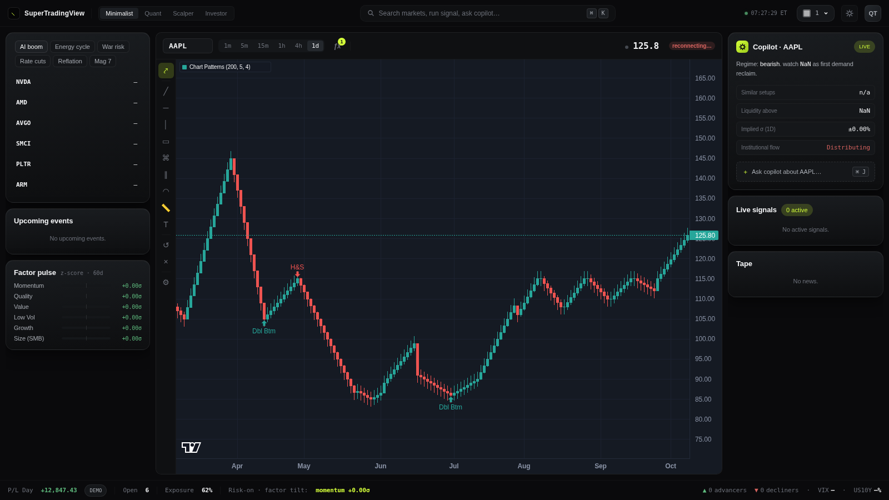

# SuperTradingView

A local trading dashboard. Watch up to 8 live charts side-by-side, each with its own symbol, timeframe, and any combination of 34 technical indicators. Crypto streams in real time from Hyperliquid; stocks / ETFs / futures / FX stream from any ticker Yahoo Finance indexes via a Flask bridge over yfinance. Live symbol search across both. Built on Lightweight Charts v5 with native multi-pane support.


---

## Features

- **Configurable grid** — 1, 2, 4, 6, or 8 charts in the cleanest layout per count (1×1, 2×1, 2×2, 3×2, 4×2). Selection persists across reloads.
- **Independent panes** — each pane picks its own symbol and timeframe (1m, 5m, 15m, 1h, 4h, 1d). Per-pane state persists in `localStorage`.
- **Two default data sources, swappable**
  - **Hyperliquid** for crypto via the public WebSocket (`wss://api.hyperliquid.xyz/ws`), opened directly from the browser. Historical candles are proxied through Flask to avoid CORS.
  - **yfinance** for everything Yahoo Finance covers — NSE/BSE Indian equities, US equities, global ETFs, indices, futures, FX, even crypto pairs. Bridged into the browser via Server-Sent Events: Flask polls every 2 s and emits on price change.
- **Pluggable data layer** — drop in Alpaca / Binance / Zerodha / Groww / Polygon by writing one class in [`data_source.py`](data_source.py) and adding it to the `REGISTRY`. No frontend changes needed.
- **34 technical indicators** with custom params and per-line colours (see table below). Sub-pane indicators render in their own pane below the candles with their own price axis.
- **Multi-instance indicators** — add the same indicator multiple times with different parameters (e.g. SMA 20 + SMA 50 + SMA 200). Each instance is tracked independently with a `#N` badge when multiple copies are active.
- **MA Crossover — Golden / Death Cross** — dedicated indicator plotting a fast MA and slow MA (SMA or EMA) with arrow markers at every crossover event.
- **Chart Pattern Recognition** — automatically scans recent price action using pivot-point analysis and annotates the chart with labelled arrows (green = bullish, red = bearish) wherever a classic pattern is detected: Head & Shoulders, Inverse H&S, Double Top, Double Bottom, Ascending Triangle, Descending Triangle, Falling Wedge, Rising Wedge, and Cup & Handle. Three tunable params: lookback bars, pivot strength, and price-equality tolerance.
- **Per-pane legend chips** in the top-left: indicator name + params + colour swatch + gear (opens modal scrolled to that indicator) + quick remove (×). Controls are hover-only to keep the chart clean.
- **Live colour-coded ticker bar** in each pane header that flashes green or red on every price change.
- **Live symbol search** — as you type in any symbol input, the dropdown queries the backend, which merges:
  - a curated quick-load list of popular Hyperliquid perps and NSE tickers (instant),
  - the full **Hyperliquid perp universe** via `/info?meta` (cached 1 hour),
  - **Yahoo Finance's global search** via `yfinance.Search` — equities, ETFs, indices, futures, crypto across every exchange Yahoo indexes.
- **No build step, no deployment, no API keys** required for the default sources.

---

## Technical Indicators (34 total)

| Category | Indicators |
|---|---|
| Moving Averages | SMA, EMA, WMA, HMA, DEMA, TEMA |
| Bands & Channels | Bollinger Bands, Donchian Channels, Keltner Channels |
| Volume-weighted | VWAP (cumulative) |
| Trend / Levels | Parabolic SAR, SuperTrend, Ichimoku Cloud |
| Oscillators | RSI, Stochastic %K/%D, Stochastic RSI, Williams %R, ROC, CCI, Awesome Osc, Ultimate Osc, TRIX, DPO, CMO |
| Momentum | MACD, ADX (+DI/−DI), Aroon |
| Volatility | ATR |
| Volume | OBV, MFI, CMF, Volume |
| Crossover | MA Crossover — Golden / Death Cross |
| Pattern Recognition | Chart Patterns (H&S, Inv H&S, Dbl Top, Dbl Btm, Asc △, Desc △, Fall Wdg, Rise Wdg, Cup+Hdl) |

### Chart Pattern Recognition

Detects 9 classic patterns using pivot-point analysis and stamps arrow markers directly on the price chart — no separate pane needed.



| Marker | Pattern | Signal |
|---|---|---|
| `H&S` | Head & Shoulders | Bearish |
| `Inv H&S` | Inverse Head & Shoulders | Bullish |
| `Dbl Top` | Double Top | Bearish |
| `Dbl Btm` | Double Bottom | Bullish |
| `Asc △` | Ascending Triangle | Bullish |
| `Desc △` | Descending Triangle | Bearish |
| `Fall Wdg` | Falling Wedge | Bullish |
| `Rise Wdg` | Rising Wedge | Bearish |
| `Cup+Hdl` | Cup & Handle | Bullish |

**Parameters** (all adjustable in the indicators modal):

| Param | Default | Range | Effect |
|---|---|---|---|
| Lookback Bars | 200 | 50–500 | How far back to scan for patterns |
| Pivot Strength | 5 | 2–20 | Bars each side required to confirm a swing high/low; higher = fewer, more significant pivots |
| Tolerance % | 4 | 1–15 | How closely price levels must match (e.g. both tops in a Double Top); raise if seeing too few hits |

---

## Drawing Tools

Each pane has a left-edge toolbar (toggle to floating palette in settings) with 9 drawing tools plus undo/erase utilities:

| Category | Tools |
|---|---|
| Lines | Trendline, Horizontal line, Vertical line |
| Bands & Channels | Rectangle / zone, Parallel channel |
| Levels | Fibonacci retracement |
| Arcs | Arc |
| Measurement | Measurement ruler (Δprice / Δ% / bars / Δtime) |
| Annotation | Text |

- **Shift-to-snap** — hold Shift while clicking to snap endpoints to the nearest OHLC of the targeted candle. Default behaviour is configurable in the ⚙ settings popover (Shift held / Always / Never).
- **Selection** — click any drawing to select it; circular handles appear (drag endpoints to reshape, drag the mid handle to move the whole shape), plus a floating mini-toolbar (✏ edit / ⎘ duplicate / ↑ bring-to-front / × delete).
- **Style modal** — colour, line width, dash pattern, opacity, label text, and extend direction per drawing.
- **Per-(symbol, source) persistence** — drawings follow the symbol across pane changes and timeframe switches; they store absolute time/price coordinates and re-project on every redraw.
- **Undo / redo** — `Ctrl+Z` / `Ctrl+Y` (also `Ctrl+Shift+Z`), 50-entry history per pane (configurable in settings). Per-pane "↺" toolbar button and "×" erase-all (with confirm) also wired.
- **Toolbar mode** — switch between fixed left-edge toolbar and a floating-palette mode (✏ in the pane header opens/closes the palette).

---

## UI / UX

### Top bar
- **Brand accent pill** — gradient mark beside the logo
- **Layout switcher** — five SVG grid-icon buttons (replaces a `<select>`) with the active layout highlighted

### Per-pane header
- **Timeframe pills** — horizontal scrollable pill row (replaces a `<select>`); active pill is highlighted
- **ƒx button** — opens the indicators modal; shows a live badge with the count of active indicators

### Indicators modal
- **Live search** — type to instantly filter the indicator list; shows an empty-state message when nothing matches
- **Active-state accent** — active indicators show a blue left-border highlight
- **Entrance animation** — panel slides up with a scale ease; backdrop fades in
- **Multi-instance UX** — "+ Add" button per indicator; each active instance shows a numbered header with a remove button and inline param editors

### General polish
- Design tokens: `--panel-3`, `--border-hi`, `--accent-hi`, consistent border radii and shadow
- Custom thin scrollbar throughout
- Hover-reveal legend controls (gear / ×)

---

## Workspace shell (Phase 1 redesign)

The single-page UI is organized around a three-column workspace: a left rail of
*narratives / factor pulse / upcoming events*, a center grid of 1-8 configurable
charts, and a right rail of *AI insight / live signals / news tape*. A 36-pixel
bottom dock shows real advancers/decliners across the curated 100-symbol
universe plus live VIX and US10Y, with a `DEMO`-tagged P/L placeholder until a
real portfolio backend lands.

- **Tokens:** obsidian + electric-lime acid accent in dark mode; warm-paper + olive
  acid in light mode. Toggle via the sun icon in the top bar; persisted to
  `localStorage["stv.theme"]`.
- **Layout selector:** top-right popover with 7 presets (`1 up`, `2 H`, `2 V`,
  `1+2`, `2×2`, `3×2`, `4×2`). Switch via mouse or `⌘/Ctrl + 1-7`.
- **Personality presets:** Minimalist / Quant / Scalper / Investor segmented
  control. Switching applies a preset's layout id + symbol set + default
  timeframe; per-pane indicators are preserved by slot index across switches.
- **Narratives:** curated themes (`AI boom`, `Energy cycle`, `War risk`, `Rate
  cuts`, `Reflation`, `Mag 7`) live in `narratives.json` at the repo root.
  Update by editing the file.
- **Factor pulse:** server-side cross-sectional z-scores over a 100-symbol
  universe in `factor_universe.json`. First load takes 30-60s (yfinance
  cold-start over 100 symbols); cached 30 minutes with stale-while-revalidate
  thereafter.
- **AI insight:** *deterministic* — derived from the active pane's history
  (regime via 200-SMA, vol-cluster detection, hidden RSI divergence,
  OBV-trended flow proxy).
- **Ask copilot:** LLM-backed Q&A about the active pane (the `Ask copilot`
  button or `⌘ J`). The backend builds a compact context block from the
  pane's recent candles (last close, bar-over-bar changes, RSI, SMA50/200,
  raw recent OHLCV) and streams a Claude answer from `POST /copilot`.
  Requires `ANTHROPIC_API_KEY` in the server environment; without it the
  endpoint returns a clear 503 and the modal shows the reason.
- **Events:** `events.json` is a hand-curated calendar of macro events for the
  next 7 days; per-symbol earnings dates come from yfinance and are cached
  one hour per ticker.
- **News tape:** RSS aggregation over Yahoo Finance, Reuters Business, and
  MarketWatch via `feedparser`. Cached 5 minutes.

The Lightweight Charts v5 chart engine, the indicator framework
(`static/indicators.js`), and the drawing layer (`static/drawings.js`) are
unchanged in this phase — only the surrounding chrome was reworked.

---

## Quick start

```bash
git clone https://github.com/raunakshroff/SuperTradingView.git
cd SuperTradingView
pip install -r requirements.txt
# Run the app
# macOS / Linux
python3 app.py
# Windows (recommended):
py -3 app.py
```

Then open <http://127.0.0.1:5173>.

Requirements: Python 3.10+ and an internet connection (for the Hyperliquid WS and yfinance HTTP calls). The Lightweight Charts library is loaded from a CDN.

Optional: export `ANTHROPIC_API_KEY` before starting to enable the LLM copilot (`⌘ J`). Everything else works without it.

Run the backend test suite with:

```bash
pytest
```

To regenerate the README screenshots (`docs/*.png`):

```bash
pip install playwright && python -m playwright install chromium
python scripts/capture_screenshots.py
```

---

## Project layout

```
SuperTradingView/
├── app.py                   # Flask routes: static, symbols, history, SSE quotes, copilot, rail data
├── data_source.py           # DataSource ABC + HyperliquidSource + YFinanceSource + REGISTRY
├── services/                # Server-side analytics, cached with stale-while-revalidate
│   ├── _cache.py            #   thread-safe in-process TTL cache
│   ├── breadth.py           #   advancers/decliners + VIX + US10Y for the bottom dock
│   ├── copilot.py           #   LLM copilot: market-context builder + Claude streaming
│   ├── events.py            #   macro calendar (events.json) + yfinance earnings dates
│   ├── factors.py           #   cross-sectional factor z-scores over factor_universe.json
│   ├── narratives.py        #   curated narrative themes (narratives.json)
│   ├── news.py              #   RSS news tape (Yahoo / Reuters / MarketWatch)
│   ├── sectors.py           #   sector lookup with on-disk cache
│   └── signals.py           #   trend-break / hidden-divergence / 20d-break scanner
├── tests/services/          # pytest suite for the services layer
├── scripts/
│   └── capture_screenshots.py  # regenerates docs/*.png via Playwright
├── symbols.json             # curated quick-load list; live search supplements it
├── narratives.json · events.json · factor_universe.json
├── requirements.txt
└── static/
    ├── index.html           # workspace shell, pane template, modals, copilot overlay
    ├── style.css · drawings.css
    ├── main.js              # entry point: boots grid, rails, dock, copilot bindings
    ├── utils.js             # fetchJSON, withAlpha
    ├── indicators.js · drawings.js   # thin re-export shims over static/modules/
    └── modules/             # ES modules
        ├── pane.js                # Pane class: chart, history load, SSE/WS subscribe, ticker
        ├── grid.js · constants.js # layout presets, pane lifecycle, persisted state
        ├── indicator-defs.js      # 34 indicator defs (build / compute / apply)
        ├── indicator-math.js · indicator-manager.js · indicators-modal.js
        ├── drawing-tools.js · drawing-layer.js · drawing-store.js
        ├── hyperliquid-ws.js      # single WS multiplexer shared by all crypto panes
        ├── ai-insight.js          # deterministic insight panel + ask-copilot modal
        ├── rail.js · news.js · events.js · factors.js · signals.js
        └── dock.js · topbar.js · command-palette.js · personality.js · symbols.js
```

---

## HTTP endpoints

| Method | Path | Purpose |
|---|---|---|
| `GET` | `/` | Serves the dashboard |
| `GET` | `/sources` | `[{name, asset_class}]` — registered data sources |
| `GET` | `/symbols` | Curated symbol list + supported timeframes |
| `GET` | `/symbols?q=...` | Live search merging curated + every source's `search_symbols(q)` |
| `GET` | `/history?source=...&symbol=...&tf=...&limit=500` | OHLCV array from the named source (`limit` clamped to 1-5000) |
| `GET` | `/stream/quotes?source=...&symbol=...&tf=...` | SSE stream of `{time, price}` ticks |
| `POST` | `/copilot` | `{question, source, symbol, tf}` → streamed plain-text LLM answer grounded in recent candles (needs `ANTHROPIC_API_KEY`) |
| `GET` | `/narratives` | Curated narrative themes from `narratives.json` |
| `GET` | `/news` | Latest 10 RSS headlines, cached 5 min |
| `GET` | `/events?symbols=A,B` | Macro calendar + per-symbol earnings dates for the next 7 days |
| `GET` | `/factors` | Factor-pulse z-scores over the universe, cached 30 min |
| `GET` | `/signals` | Top-5 live signals (trend break / hidden div / 20d break), cached 60 s |
| `GET` | `/quote/breadth` | `{adv, dec, us10y, vix}` for the bottom dock, cached 60 s |

---

## Adding a new data source

Subclass `DataSource` in [`data_source.py`](data_source.py) and register it:

```python
class AlpacaSource(DataSource):
    name = "alpaca"
    asset_class = "stock"

    def get_history(self, symbol: str, timeframe: str, limit: int = 500) -> list[Candle]:
        ...

    def stream_quotes(self, symbol: str, timeframe: str) -> Iterator[Quote]:
        # yield Quote objects; Flask /stream/quotes relays them via SSE
        ...

    def search_symbols(self, query: str) -> list[dict]:
        # Called by /symbols?q=... — return up to ~25 matches as
        # [{symbol, label, source: "alpaca", asset_class}, ...]
        ...

REGISTRY["alpaca"] = AlpacaSource()
```

`search_symbols` is optional — return `[]` to opt out and add entries to `symbols.json` instead.

---

## Adding a new indicator

Append one definition to `DEFS` in [`static/indicators.js`](static/indicators.js):

```js
{
  id: "myind", name: "My Indicator", category: "Custom",
  overlay: true,        // true = draws on candle pane, false = own sub-pane
  params: [{ key: "period", default: 14, min: 2, max: 500 }],
  colors: [{ key: "line", label: "Line", default: "#42a5f5" }],
  build:   (chart, paneIndex, col) => [ohlcLine(chart, col.line, paneIndex)],
  compute: (candles, p)            => myMath(candles, +p.period),
  apply:   (series, data)          => series[0].setData(data),
}
```

The modal, chart wiring, persistence, sub-pane layout, legend chip, multi-instance support, and colour pickers all pick it up with no further changes.

---

## Architecture notes

- **Frontend is a single page with no framework and no build step** — vanilla-JS ES modules under `static/modules/`, booted by `static/main.js`. One chart instance per pane, organised around the `Pane` class.
- **Hyperliquid WebSocket multiplexer** — a single WS connection feeds every crypto pane via a callback registry, with exponential-backoff reconnect (1 s → 30 s cap).
- **yfinance over SSE** — `stream_quotes()` is a Python generator polled every 2 s; the browser patches the in-memory candle array via `EventSource`.
- **Services layer with stale-while-revalidate caching** — news / events / factors / signals / breadth each live in one module under `services/`, sharing a thread-safe TTL cache (`services/_cache.py`). A stale value is served instantly while one background thread recomputes, so slow yfinance scans never block a request after first warm-up.
- **Lightweight Charts v5 multi-pane** — sub-pane indicators are added via `chart.addSeries(LineSeries, opts, paneIndex)` with proportional `setStretchFactor`.
- **Indicator instance keys** — first instance uses bare `defId` (e.g. `"sma"`) for backward compat with persisted state; subsequent instances append `~<timestamp>` (e.g. `"sma~1716200000000"`).
- **State persistence** — `stv.layoutId`, `stv.panes`, `stv.theme`, `stv.personality`, and `stv.drawingPrefs` in `localStorage`. Per-pane state shape: `{ source, symbol, tf, indicators: { [key]: { ...params, colors: { [slot]: hex } } } }`. Legacy `stv.chartCount` is migrated to `stv.layoutId` on first load.
- **Tests** — `pytest` covers the services layer (cache semantics, signal math, factor math, feed parsing) with yfinance/feedparser mocked; frontend testing is manual.

---

## License

MIT
